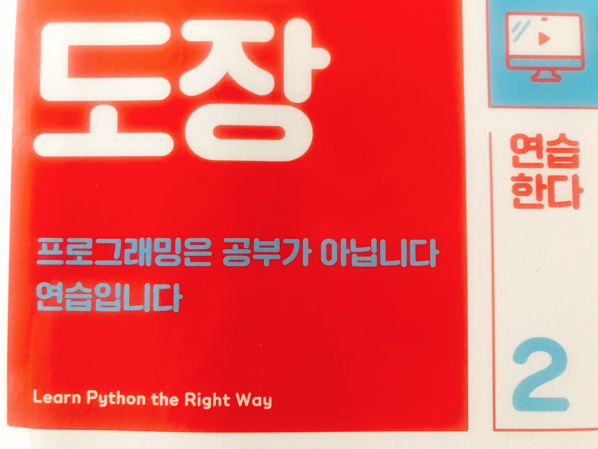
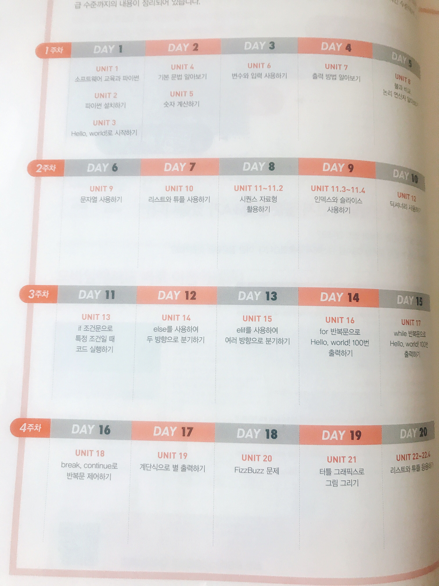
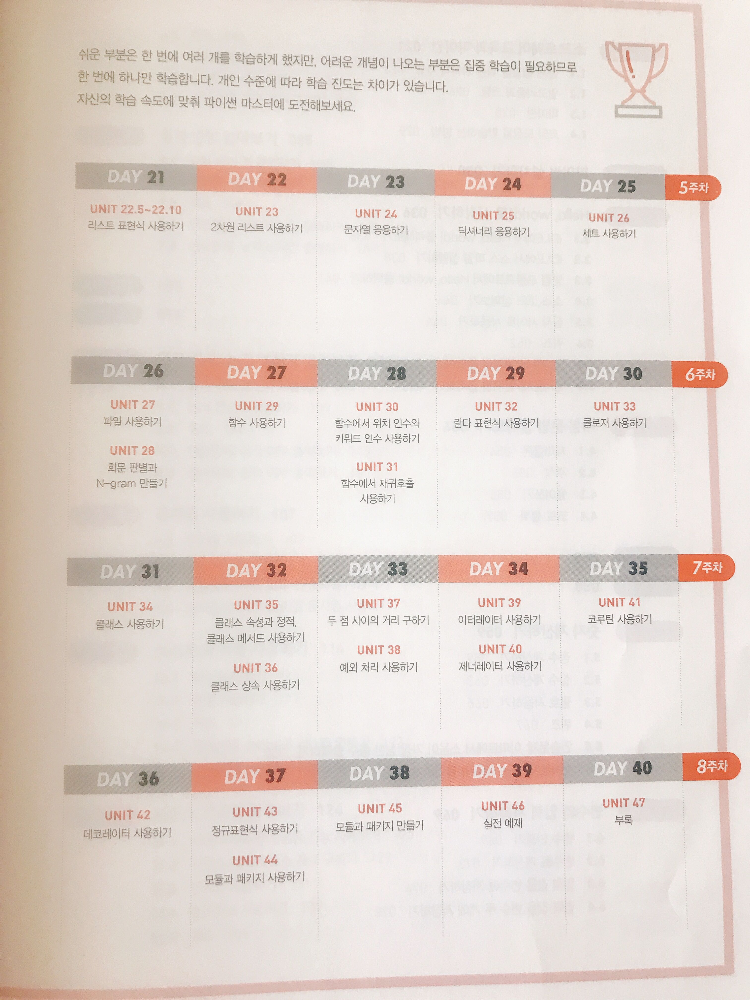
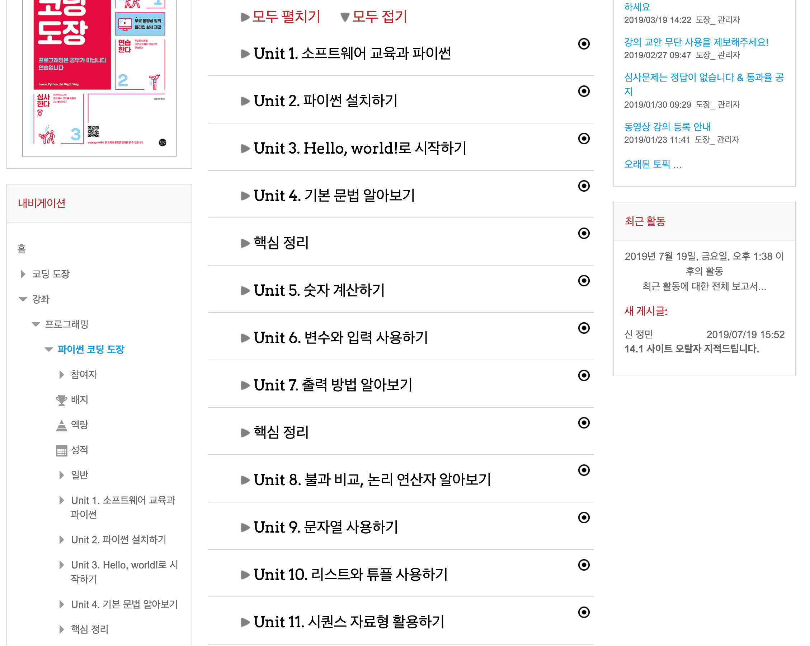
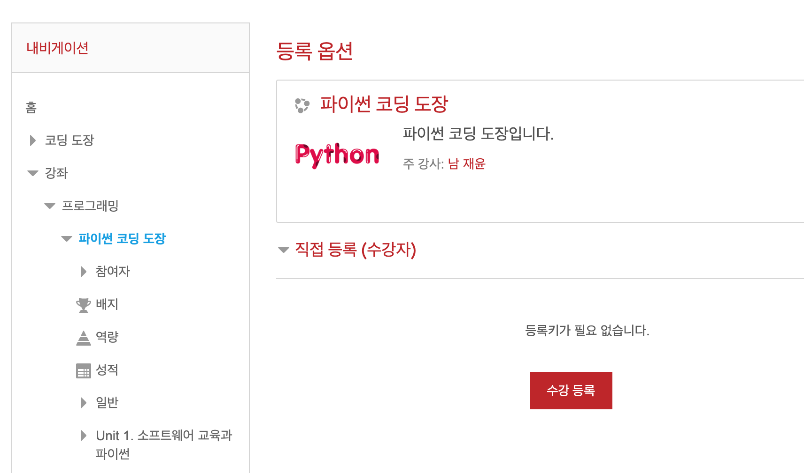

페이스북 길벗 출판사의 리뷰 이벤트에 신청하고 참여하게 되어 리뷰를 작성하게 되었습니다.  

[페이스북 길벗 출판사 채널](https://www.facebook.com/gbitbook/)  
팔로잉 해두면 다양한 이벤트나 IT서적 관련 정보들이 많이 올라오니 관심있는 분들은 팔로잉하는걸 추천합니다.  

## 파이썬 코딩 도장

### 개발, 외우는 것이 아니라 여러번 부딪혀보는것이 좋다.

내가 개발을 처음 접할 때 들었던 이야기이다.
>> 개발은 무작정 외우는것이 아니라 직접 구현해보고 문제에 부딪히고 해결하는 과정에서 향상한다.  

파이썬 코딩 도장 표지에 써져있는 프로그래밍은 공부가 아닌 연습이라고 하는부분은 크게 와닿는 부분이었다.  

### 단계별로 차근차근 학습하게 되어있다.

- 막상 책을 사도 계획을 어떻게 잡을지 막연한 사람을 위해 체계적으로 학습할 수 있도록 8주 학습 프로그램을 제공해주고 있다.

각 파트별 진행 단계 또한 **이론 - 사용 - 퀴즈 - 연습문제 - 심사문제** 로 이루어져 있기때문에, 학습한 이론에 대해 체계적으로 학습할 수 있다.

### 온라인 강의 제공

일단 책 자체의 내용은 온라인에 올라와 있고, 무료 동영상 강의나, 바로바로 테스트해볼수 있는 환경을 제공하기 때문에, 파이썬을 처음접하거나, 다시한번 파이썬 기초에 대해 공부하는데 적합한 책이라고 생각한다.  
[파이썬 코딩 도장 온라인강의](https://dojang.io/)  

- 자세하게 잘 정리되어있다.  

- 연습문제를 풀때 강좌 등록을 요구하지만 등록하는데 키는 따로 필요없기때문에 무료로 파이썬을 학습할 수 있다.

나 역시 파이썬에 다시 처음부터 정리하고 싶어서 리뷰이벤트에 신청하게 되었고, 운 좋게 리뷰어에 선정되어 책을 받게 되었다.  

아직 책을 완독하지는 못했지만, 꼼꼼하게 강의를 들으면서 공부를 할 수 있고, 이전에 공부했던 파이썬을 다시한번 remind하는 느낌으로 보는데도 놓치고 잊고있던 부분들을 다시한번 잡을 수 있어서 만족스러웠다.  
  
  
#### 책을 추천하는 사람
- 파이썬에 대해 차근차근 공부하고싶은데 마땅히 피드백을 줄 사람이 없는 경우
- 파이썬에 대해 배웠지만 다시 한번 파이썬 이론에 대해 학습하고 싶은 개발자

#### 장점
- 체계적인 학습 프로그램을 제공하여 차근차근 학습할 수 있다.
- 온라인으로 모든 정보가 공개되어 있고, 무료로 학습할 수 있다.
- 온라인을 통해 직접 문제풀이를 하고 연습문제/심사문제를 통해 학습한 내용에 대해 제대로 확인 할 수있다.
- 스마트폰으로도 학습 할 수 있기때문에, 출퇴근 길이나 이동시간이 긴 경우 모바일로 학습할 수 있다.

#### 아쉬운 점
- 파이썬과 함께 Database를 다루는 내용이 부족해서 약간 아쉽긴 했다.
